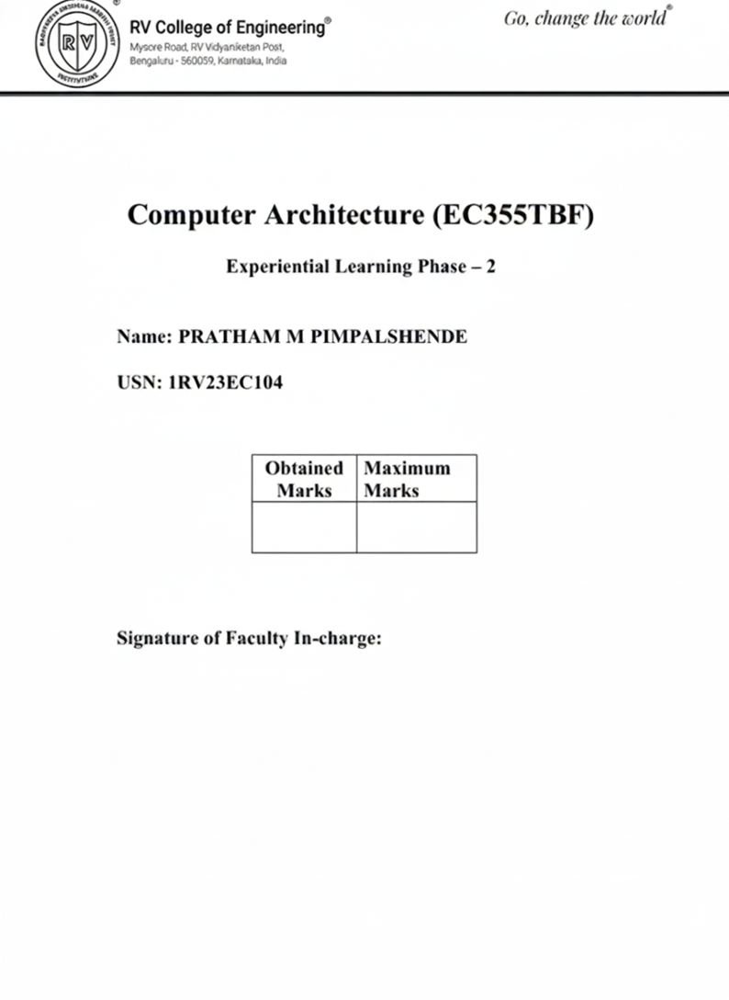
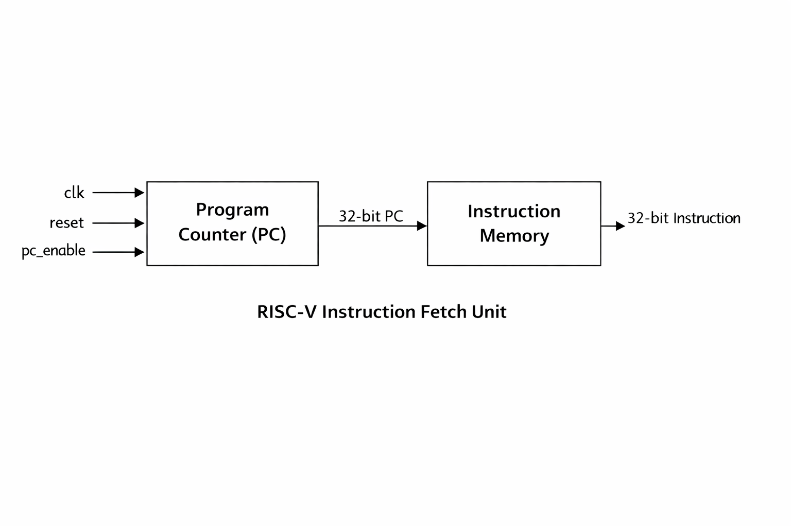
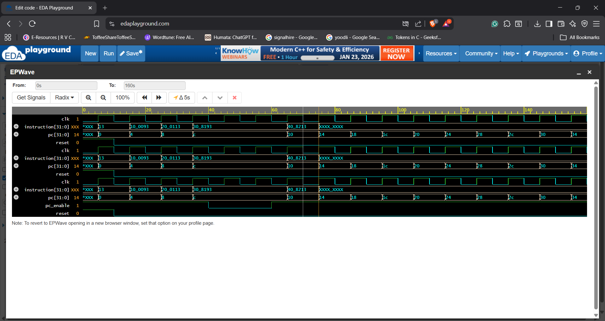
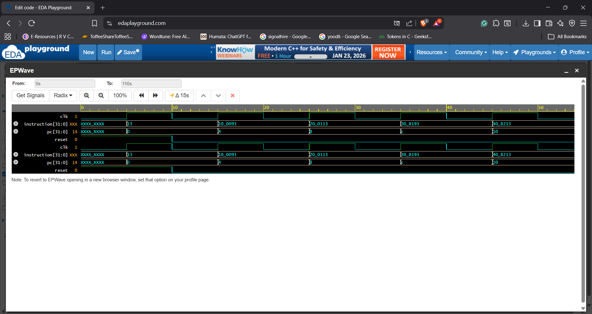
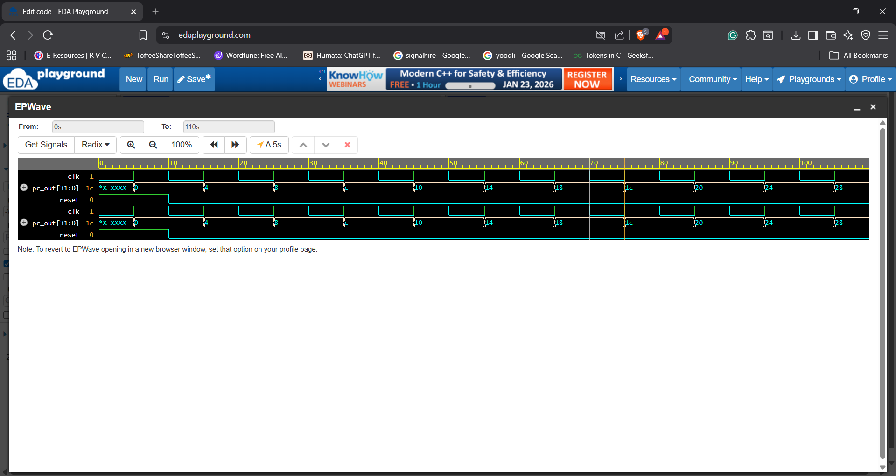

 
 

 # Design and Implementation of a RISC-V Instruction Fetch Unit

## 1. Introduction
In a processor architecture, instruction execution begins with the instruction fetch stage. The Instruction Fetch Unit (IFU) is responsible for generating the address of the next instruction and fetching the corresponding instruction from memory. In the RISC-V Instruction Set Architecture (ISA), instructions are fixed-length 32-bit words and are stored sequentially in memory, making the instruction fetch process systematic and predictable.
This project focuses on the design and simulation of a RISC-V Instruction Fetch Unit (IFU) using Verilog HDL. The IFU generates instruction addresses using a Program Counter (PC), increments the PC according to the RISC-V specification, and fetches 32-bit instructions from instruction memory. The design is verified through simulation and waveform analysis.

## 2. Objective of the Project
The objectives of this project are:
•	To understand the role of the Instruction Fetch Unit in a RISC-V processor
•	To design a Program Counter with reset and enable functionality
•	To implement instruction memory for instruction fetching
•	To generate correct instruction addresses according to RV32I specification
•	To verify the IFU functionality using simulation and waveform analysis
•	To gain practical exposure to processor datapath components

## 3. What is an Instruction Fetch Unit (IFU)?
The Instruction Fetch Unit is the first stage of a processor pipeline. It is responsible for:
•	Holding the address of the current instruction using the Program Counter
•	Updating the Program Counter to point to the next instruction
•	Fetching the instruction from memory
•	Providing the fetched instruction to the next stage of the processor
Since instruction fetching must occur every clock cycle and does not involve complex arithmetic, the IFU consists mainly of control and address-generation logic.

## 4. RISC-V Instruction Fetch Mechanism
In the RISC-V RV32I architecture:
•	Each instruction is 32 bits (4 bytes) wide
•	Instructions are word-aligned in memory
•	The Program Counter increments by 4 to fetch the next instruction
The instruction memory is accessed using the Program Counter value, and the fetched instruction is output as a 32-bit value.

## 5. Block Diagram

 The block diagram illustrates the structure of the Instruction Fetch Unit. It consists of a Program Counter (PC) and an Instruction Memory block. The Program Counter generates the instruction address, which is supplied to the instruction memory to fetch the corresponding 32-bit instruction.

## 6. Working Principle
The working of the Instruction Fetch Unit is summarized below:
1.	A clock and reset signal are applied to the IFU
2.	On reset, the Program Counter initializes to zero
3.	On each rising edge of the clock, the PC increments by 4
4.	The PC value is used to address the instruction memory
5.	The instruction memory outputs the corresponding 32-bit instruction
6.	A PC enable signal allows stalling of the Program Counter when required
The IFU operates synchronously with the clock and ensures correct instruction sequencing.

## 7. How to Run the Implementation
1.	Open https://www.edaplayground.com
2.	Select Verilog as the language
3.	Paste the following files into the design section:
o	instruction_fetch_unit.v
4.	Paste tb_instruction_fetch_unit.v into the testbench section
5.	Enable EPWave for waveform viewing
6.	Run the simulation
7.	Observe pc and instruction signals in the waveform window

## 8. Simulation and Verification
The design is simulated using Icarus Verilog on EDA Playground. A Verilog testbench generates clock, reset, and PC enable signals to verify the behavior of the Instruction Fetch Unit. Waveform analysis using EPWave (GTKWave) confirms correct Program Counter operation and instruction fetching.

## 9. Expected Output
•	Program Counter initializes to zero on reset
•	PC increments by 4 on each clock cycle
•	Correct 32-bit instruction is fetched for each PC value
•	PC remains constant when PC enable signal is disabled (stall condition)
•	Instruction output remains stable during stall
The output strictly follows the RISC-V RV32I specification.

## 10. Example Output and Analysis
Simulation waveforms show that the Program Counter increments sequentially by 4 and the instruction memory outputs the correct instruction corresponding to each PC value. During PC stall conditions, the PC and instruction outputs remain unchanged, confirming correct stall behavior. These observations validate the correct design and functionality of the Instruction Fetch Unit.

 

### Figure 1: Program Counter Increment Operation
This waveform shows the operation of the Program Counter (PC) module. After reset is deasserted, the PC value starts from 0x00000000 and increments by 4 on every rising edge of the clock.
Observation:
The PC values observed are:
0x00 → 0x04 → 0x08 → 0x0C → 0x10 → 0x14 → …
Analysis:
This confirms that the Program Counter correctly follows the RISC-V RV32I specification, where each instruction is 32 bits (4 bytes) wide. The reset signal initializes the PC to zero, and sequential instruction addresses are generated correctly.

 
### Figure 2: Instruction Fetch from Instruction Memory
Description:
This waveform shows the interaction between the Program Counter and Instruction Memory. As the PC value changes, the corresponding 32-bit instruction is fetched from instruction memory.
Observation:
For each PC value, a valid instruction word is observed at the instruction[31:0] output. The instruction changes synchronously with PC updates.
Analysis:
The waveform verifies correct addressing of instruction memory using PC[31:2] for word alignment. This confirms that the Instruction Fetch Unit is able to fetch the correct instruction for each address generated by the Program Counter.

 
### Figure 3: PC Enable (Stall) Functionality
Description:
This waveform demonstrates the effect of the pc_enable signal on the Instruction Fetch Unit. During the period when pc_enable is deasserted, the PC does not increment.
Observation:
•	When pc_enable = 0, the PC value remains constant
•	The instruction output also remains unchanged
•	When pc_enable is reasserted, normal PC increment resumes
Analysis:
This confirms correct stall behavior of the Instruction Fetch Unit. Such functionality is essential in real processors during pipeline stalls or memory wait conditions, ensuring that instructions are not fetched prematurely.

## 11. Future Scope
The current implementation serves as a foundational Instruction Fetch Unit and can be extended in the future to include:
•	Branch and jump target handling
•	Integration with instruction decode stage
•	Pipelined instruction fetch architecture
•	Instruction cache integration
•	Exception and interrupt handling

## 12. Video Explanation
A one-minute video explaining the project is provided. The video includes a brief personal introduction followed by an explanation of the Instruction Fetch Unit architecture, working principle, and simulation results.

## 13. Conclusion
This project successfully demonstrates the design and simulation of a RISC-V Instruction Fetch Unit using Verilog HDL. The design adheres to the RV32I specification and correctly fetches instructions using a Program Counter and instruction memory. The project provides a strong foundation for understanding processor data path design and serves as a building block for more advanced RISC-V processor implementations.

